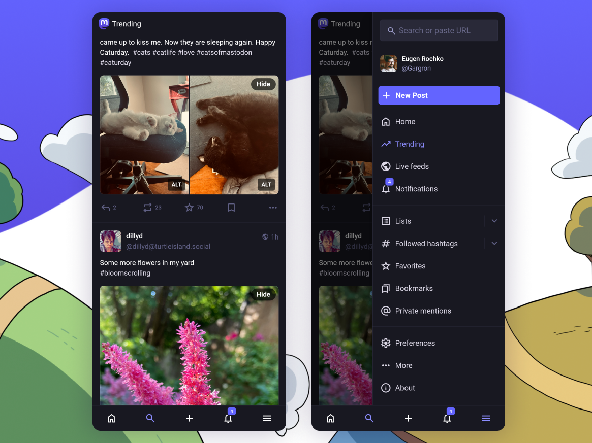

Mastodon 4.4 is here, bringing you new ways to showcase yourself, manage your growing network, and enjoy what's in your timeline. Administrators and moderators also gain new tools for keeping communities safe.

As always, if you use [mastodon.social](http://mastodon.social), you may already have seen some of the updates as they gradually showed up across the user experience. Rolling out a new stable release enables us to share all of that goodness across the whole Mastodon community. We encourage all server operators to [upgrade to Mastodon 4.4](https://github.com/mastodon/mastodon/releases/tag/v4.4.1), starting today.

🔍 If you’re a developer building on Mastodon, you should check out our [Mastodon 4.4 for Developers](https://blog.joinmastodon.org/2025/07/mastodon-4-4-for-devs/) post, for all the additions and changes in the Mastodon API. 🛠

## Profiles, and managing your network

Your profile is the main way that people find out more about you on Mastodon, and we want to make it easier to navigate it and highlight what you’re about.

<video src="profile.mp4" autoplay playsinline muted loop class="rounded-md shadow-lg"></video>

Do you post all of your cat pictures under #CatsOfMastodon? Simply tap “Feature on my profile” on the hashtag page, and people will be able to browse all of your #CatsOfMastodon posts specifically from the new “Featured” tab on your profile. Do you want to promote cool and interesting accounts? Tap “Feature on my profile” on a person’s profile, and they will likewise appear on your “Featured” tab.

On Mastodon, you can pin up to 5 posts on your profile, so you can feature your best work, or plug your latest project. The downside is that if you wanted to see someone’s most recent post, it introduced a bit of scrolling to get there. No more! We’ve reduced the amount of scrolling you have to do, by combining all pinned posts in a single carousel at the top of the profile.

To make it easier to see at a glance if the profile belongs to someone you might know, we’ve added a little widget showing how many of the people you follow are following that person to the top of their profile. This also shows up in the profile preview that appears when you hover over their name somewhere else. Don’t want someone to follow you anymore? You don’t have to block them, simply tap “Remove follower” in the dropdown menu on their profile.

## Enhanced list management

Lists in Mastodon allow you to declutter your home feed by organising accounts you follow into arbitrary alternative feeds. Creating and managing lists has been significantly streamlined, and it’s easier than ever to add and remove accounts from your lists both directly from profiles and from your own follows and followers listings.

<video src="lists.mp4" autoplay playsinline muted loop class="rounded-md shadow-lg"></video>

## Media controls

Mastodon doesn’t just support pictures and videos—you can upload audio on the platform. Since every Mastodon profile comes with an RSS feed, some people actually publish their podcasts this way. We’ve just given our audio player a facelift, making it a bit more visually pleasant and a lot easier to use by putting the play and pause front and centre and adding quick shortcuts for skipping forward and backward. We’ve also expanded hotkey controls for audio and video: left and right arrow to skip around, up and down arrow to control the volume, “m” to mute, “f” for full screen, and so on.

<video src="media.mp4" autoplay playsinline muted loop class="rounded-md shadow-lg"></video>

If you like to pixel-peek images, or admire the pleasant grain of scanned in analogue photos, we’ve made zooming in more intuitive: simply double tap the image once you’ve clicked to open it. Panning around has also been made smoother. On touch devices, you can now pinch the image with your fingers to zoom it to the desired level, and swiping up when the image is zoomed out will close it, like you would expect from your native photo app.

We are proud of Mastodon’s strong accessibility and inclusivity culture, which has fostered a larger presence of vision impaired users. To support this community, we’ve added a new reminder to add alt text when posting images or video. Alt text isn’t just helpful to those who use screen readers: it can provide extra context to sighted users, and as it’s indexed in Mastodon’s search system, it can help you and others find your post better. Of course, this reminder can be disabled from preferences. We’ve also added some tips on writing good alt text into the user interface.

## Navigation enhancements

We’ve revamped the mobile web interface to mimic native apps, with important actions easily accessible in a bottom toolbar that frees up more space for your timeline. We’ve also begun experimenting with ways to make navigation more consistent across devices, and to make relevant content (like followed hashtags and trending content) more easily discoverable. The Explore item has been renamed to Trending, to reduce the need for banners within the Explore page to explain each feed. The navigation sidebar is divided into three sections. At the top is a section for the main navigation areas, which mirrors the bottom navigation bar on smaller screens. Next, a “Library” section, which contains your own curated content - bookmarks, favourites, and lists, and your followed hashtags, now in a more visible location (in response to community feedback). Finally, other elements are in the last section. This brings all the navigation elements into a single place.

We’ve also streamlined the onboarding flow for new users. What used to be a list of four items you could check off as part of onboarding, has become a simpler two-step process where you first fill out your profile, and then follow a few users of your choosing. Importantly, we’ve made search an integral part of this process so people don’t feel confined to the list of recommended accounts we’ve generated for them, but can feel free to immediately begin searching for people they might know.

## Features for Administrators

We’ve made a range of updates and improvements for people who operate their own Mastodon servers. Some of these are [legal compliance features](https://blog.joinmastodon.org/2025/05/legal-features-updates/), such as adding and managing Terms of Service, offering translations of server rules into different languages, and optionally setting a minimum age requirement for new user sign-ups. Our earlier blog post covers each of these topics in more detail.

As well as the legal features, there are a couple of other useful items that administrators should look at. Server owners can now send important announcements to all users via email, for critical communications that cannot be opted out of (essential for emergency notifications, or major policy changes). There is also a new system for moderators to keep internal notes about moderation decisions and user interactions. This should help to improve coordination across moderation teams, and help to keep track of decision making.

## Quote Posts (part one)

Earlier in the year, we shared our thought process about [bringing the much-requested Quote Posts feature to Mastodon](https://blog.joinmastodon.org/2025/02/bringing-quote-posts-to-mastodon/). We’ve worked hard on bringing this capability to the platform while maintaining the strong safety principles that Mastodon is known for. Since Mastodon runs on over 8,000 independent servers that together form the platform you know, releasing features like this requires a two-pronged approach: first we release code that supports processing and displaying this new format, and then release code that allows our users to actively use the feature. This ensures all of our users can see this new type of content before anyone can create it. As part of our 4.4 release, you will be able to see quotes from compatible Fediverse platforms (including future Mastodon releases), but you will not yet be able to quote posts yourself. That capability will come in 4.5.

## Looking ahead

We’re really happy that this is the first version released by [our expanded team](https://blog.joinmastodon.org/2025/05/evolving-the-team/) as a whole! We have some exciting plans, and will get moving towards version 4.5 right away.

Key items for the next few months include: enabling anyone to create Quote Posts; some new features for organisations that run their own servers (for example, greater instance customisation); and, the ability to fetch replies to posts from many different instances, to improve the ability to follow conversations that include people your server is not yet aware of.

We plan to have 4.5 ready for everyone later in the year, and we have a lot of other exciting things to work on once the next release is ready. Stay tuned!

## Support Mastodon

Thank you to everyone that contributed to this release, including our team, our community, and the many contributors from across the Fediverse. We’re excited to continue building Mastodon together with you.

We’re going through a formal process of [setting up a new European non-profit organisation](https://blog.joinmastodon.org/2025/01/the-people-should-own-the-town-square/) so that Mastodon remains free, open, and not owned by any single individual (more updates on our progress, very soon). **We depend on your support** as we build, support, and advocate for decentralised and non-commercial social media.

We don’t take venture capital, we don’t sell ads, and we don’t sell your data - unlike many other platforms out there. **Please support our mission**, so that we can continue to make Mastodon better.


