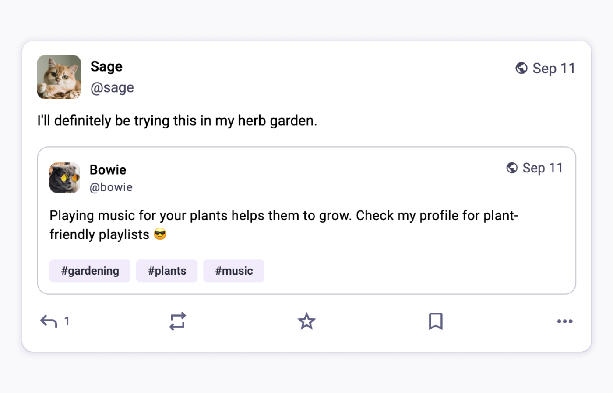
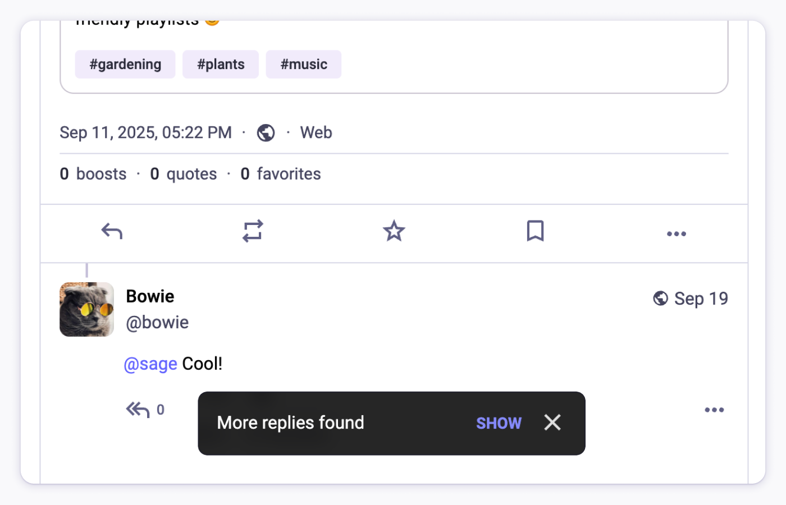
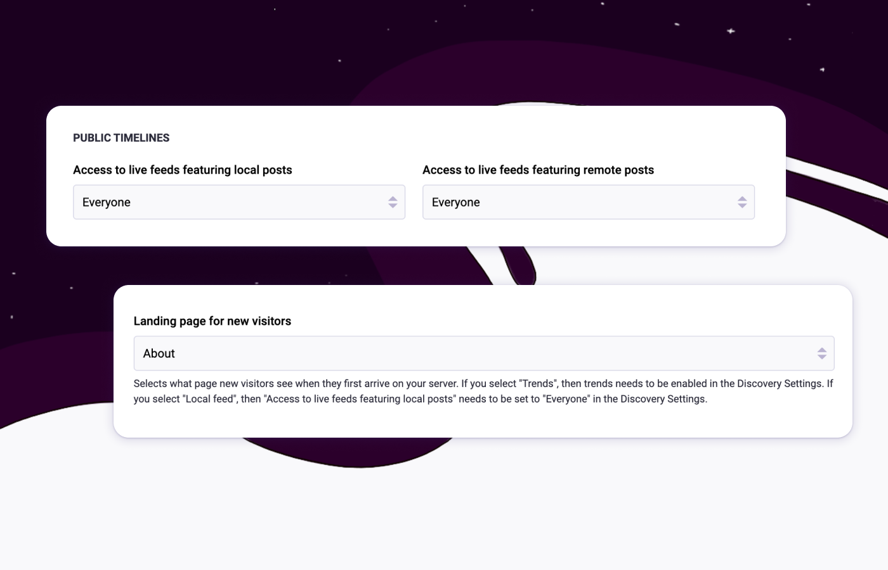
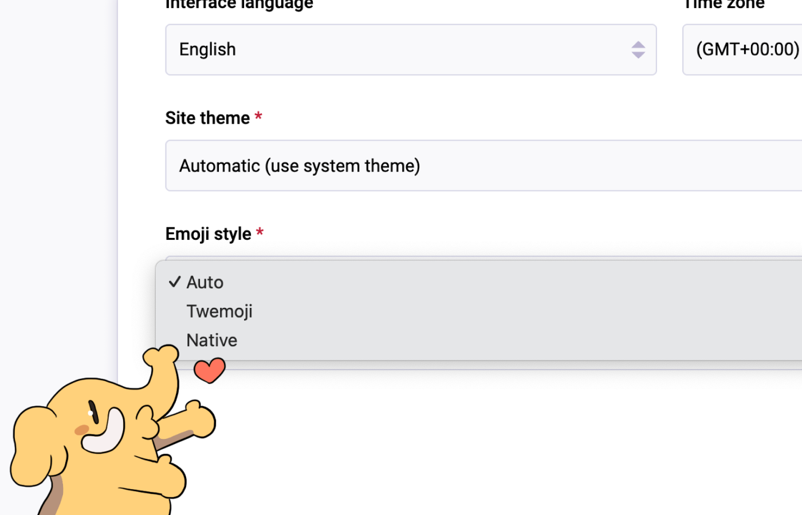

Mastodon 4.5 has arrived, with enhanced conversations across communities, expanded moderator tools, and new ways for admins to showcase their server communities. Read on for more details.

As always, if you use [mastodon.social](http://mastodon.social), you may already have seen some of the updates as they gradually showed up across the user experience. Rolling out a new stable release enables us to share all of that goodness across the whole Mastodon community. We encourage all server operators to [upgrade to Mastodon 4.5](https://github.com/mastodon/mastodon/releases/tag/v4.5.0), starting today.

🔍 If you’re a developer building on Mastodon, you should check out our [Mastodon 4.5 for Developers](https://blog.joinmastodon.org/2025/10/mastodon-4-5-for-devs/) post, for all the additions and changes in the Mastodon API. 🛠

## Quote Posts: Consent and Conversation

Quoting has been integral to deepening discussions online, and it's now available in Mastodon 4.5. This release not only introduces authoring capabilities but also mechanisms prioritizing user safety and privacy. Authors can limit and disable quoting, both globally on the new Posting Defaults page, and individually on specific posts. Also, when quoted, they can easily revoke the use of their post.

Learn more about Quote posts in our [previous blog post](https://blog.joinmastodon.org/2025/09/introducing-quote-posts/), our [FAQ](https://docs.joinmastodon.org/user/quote-posts/#faq), and our [developer implementation guide](https://docs.joinmastodon.org/client/quotes/).

## Fetch All Replies: Completing the Conversation Flow

Users on servers running 4.4 and earlier versions have likely experienced the confusion of seeing replies appearing on other servers but not their own. Mastodon 4.5 automatically checks for missing replies upon page load and again every 15 minutes, enhancing continuity of conversations across the Fediverse.

## Enhanced Features for Server Administrators

For server operators, especially those running smaller, organisational instances, we continue to deliver new tools that enable greater instance customisation:

- **Feed Management**

    The ability to disable some of the content feeds for either visitors or logged-in users, offering greater control over content flow.

- **Visitor Homepage**

    In addition to trends or about pages, administrators can now set the local feed as the home page for visitors. This is useful for small organization servers where there are seldom any trending posts, allowing visitors to see local activity immediately.

- **Targeted Blocking**

    Server owners now have tools to block specific usernames. This process can be configured with options for partial matches or character variations, or to mark a potential user match as needing review by a moderator.

- **Moderation Context**

    The moderator interface has received improvements to display crucial context, such as link previews and quote posts in messages, supporting more rapid and informed decision-making.

## Native Emoji support

The web interface now includes support for displaying native emoji. A new setting is available to manage how emoji appear to you.

## Looking ahead

Our team is already working on Mastodon 4.6 (tentatively planned for the first quarter of next year). We shared our [early explorations around Packs](https://blog.joinmastodon.org/2025/10/our-ideas-about-packs/) and are planning to include the first parts of this feature in our next version. It will also include improvements to onboarding, and some features targeted toward institutions with a presence on Mastodon, thanks to a [grant by NLNet and NGI Zero Commons Fund](https://nlnet.nl/project/Mastodon-for-institutions/).

We just updated [our public roadmap](https://www.staging.joinmastodon.org/roadmap) to provide better transparency on what is currently in the works, and what we are planning to focus on next.

## Support Mastodon

Thank you to everyone that contributed to this release, including our team, our community, and the many contributors from across the Fediverse. We’re excited to continue building Mastodon together with you.

We’re going through a formal process of [setting up a new European non-profit organisation](https://blog.joinmastodon.org/2025/01/the-people-should-own-the-town-square/) (more update on this topic very soon!) so that Mastodon remains free, open, and not owned by any single individual . **We depend on your support** as we build, support, and advocate for decentralised and non-commercial social media.

We don’t take venture capital, we don’t sell ads, and we don’t sell your data - unlike many other platforms out there. **Please support our mission**, so that we can continue to make Mastodon better.


