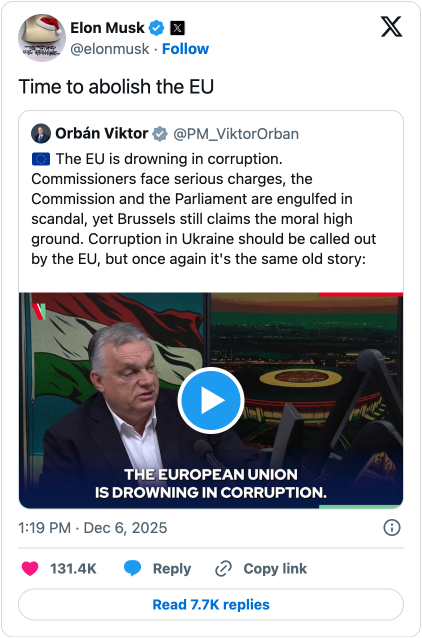

Elon Musk’s X platform has [blocked the European Commission from making advertisements](https://www.bbc.com/news/articles/c0589g0dqq7o), presumably in response to the €120 million fine for its misleading verification system and overall lack of transparency. We’re grateful to Elon Musk for proving once again why the world needs to log off corporate-owned, centrally-controlled social media platforms and log on to a better way of being online. The world needs an open social web through the fediverse and Mastodon.

Calls for public institutions to invest in digital sovereignty are increasing across civil society. The term [digital sovereignty](https://www.europarl.europa.eu/RegData/etudes/BRIE/2020/651992/EPRS_BRI(2020)651992_EN.pdf) means that an institution has autonomy and control over the critical digital infrastructure, data, and services that make up their online presence. Up until this point, social media has not been a part of this conversation. We think it is time to change that.

In any free society, it is the right of every citizen to access and comment on the news, decisions, and reasonings of their government. We believe it is a government’s responsibility to ensure this right for its constituents. Public institutions should communicate with their citizens on open platforms, not ones that require creating an account and sending personal data to a self-serving tech company. Today, institutions often communicate through the censorious filter of corporations that do not have the best interests of people or society at heart. They let their message be governed by the whims of out-of-touch and overpaid people who believe they should have unchecked power. We cannot let this stand. Mastodon offers a path forward for any institution that wants to take control of their communications, and [we can help you get started](https://joinmastodon.org/hosting) today.

One of the tools these corporate social media platforms use to control an institution’s communications is the algorithm. Platforms strategically tune their algorithms to make it difficult, if not impossible, for institutions to reach their people without paying the platform ad money. Musk’s move to turn off the European Commission’s advertising capabilities feels like a perverse power play over a legitimate fine, one that effectively silences a crucial avenue for public discourse. We should be horrified that any single individual can wield such influence over the relationship between governments and the people they represent. We should be especially concerned when that individuakl doesn’t think our governments should exist in the first place.

Mastodon’s chronological timeline means that no institution needs to game an algorithm to keep their people informed. By using hashtags, it’s easy for people who care about the topics you discuss to find you. What’s more, your constituents don’t need to be on Mastodon to follow your posts. They can subscribe via open protocols like RSS and [soon via email](https://joinmastodon.org/roadmap). When it comes to the source of the fine in the first place—X’s infamous blue checks, a.k.a. verification—Mastodon also offers a better way. We empower people to [verify themselves](https://joinmastodon.org/verification) by linking their social profile to their official (or personal) website. This allows for greater transparency and trust than relying on the often less-than-reputable verification practices of a single corporate entity, especially one that is willing to sell reputation for a low monthly fee. (Meanwhile, another corporate social media platform made $16 billion, 10% of their 2024 revenue, from [advertisements for scams and banned goods](https://www.reuters.com/investigations/meta-is-earning-fortune-deluge-fraudulent-ads-documents-show-2025-11-06/).)

In an era where information is power, it’s disheartening to see our institutions yield so much to the whims of industry and individuals. In contrast, the European Commission is leading the way in taking ownership of social sovereignty on behalf of their people. They own a Mastodon instance, [ec.social-network.europa.eu](https://ec.social-network.europa.eu/about), to reach Europeans directly and keep them well informed. Mastodon is proud to help them manage the technical side of things. If you are someone on the fediverse who would like to see their government own their social sovereignty, we encourage you to get in touch with your local representative and tell them why you think they should start using open social media networks like the fediverse. We’re starting a thread on Mastodon of resources to help you get in touch with your local representative here.

By making the news and truth contingent on advertising budgets we’ve created an environment where any narrative can win, as long as the storyteller is willing to pay. If we allow these conditions to continue, we will leave behind the voices that truly matter; the people and their public institutions. It is critical that those voices not be silenced forever. The promise of the fediverse is the promise of a better way forward: free from ads and manipulative algorithms, a place built by and for people like you, where our sovereignty is a right and not a privilege.

It will take all of us working together to build a better way of being online. If you want to start an instance or have ideas about how we can encourage more institutions to take control of their social sovereignty, get in touch us at [hello@joinmastodon.org](mailto:hello@joinmastodon.org).
