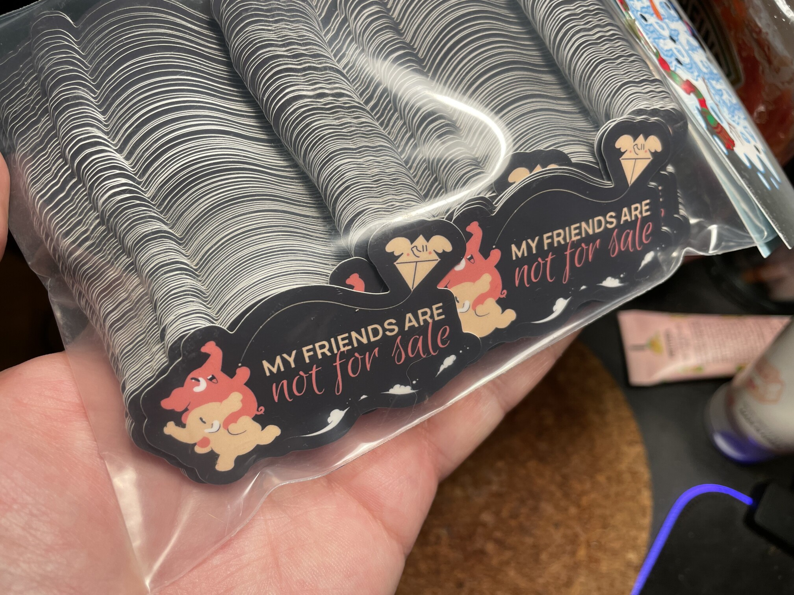
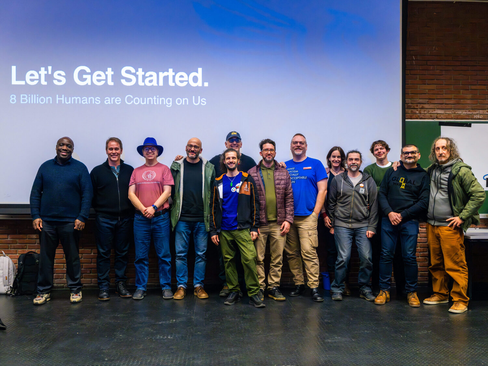

This year, the Mastodon team returned to [FOSDEM](https://fosdem.org) for the third time. FOSDEM is an annual gathering of open source developers, held in Brussels. We’re excited to report that the Fediverse is feeling vibrant!

FOSDEM has become a central element of [EU Open Source Week](https://opensourceweek.eu/) - a series of events, meetups and workshops that have formed around the conference itself. The range of events makes this trip to Brussels valuable for our team, with opportunities to meet other projects, non-profit organisations, open source foundations, and policymakers.

On Friday evening before FOSDEM, a group of around forty Fediverse supporters, builders and enthusiasts got together for a social meetup. This was the first time that several prominent developers across the ActivityPub ecosystem had met in person, and there was an immediate sense of excitement and anticipation! We enjoyed the chance to meet up with both community members, and also developers working on other ActivityPub-related projects.

FOSDEM itself runs across Saturday and Sunday. The team had a table with handouts that explained the project; a slideshow covering improvements since last year’s event as well as our roadmap; and some pins and stickers for sale. A few lucky visitors were able to pick up a special _limited-edition_ sticker featuring a “My friends are not for sale” tagline. The [Plushtodons](https://shop.joinmastodon.org/products/mastodon-stuffed-toy-mini) also made an appearance, for photo opportunities - unfortunately we were not able to transport any for sale, but folks were able to order new friends directly from the online store.

<figure>
  
  <figcaption>My friends are not for sale stickers - only available at FOSDEM (so far)</figcaption>
</figure>

Reflecting on our third trip to FOSDEM, we've been thinking a lot about how things have developed in only three years:

- in 2024, Mastodon was the first (and so far, remains the only) Fediverse project to get a stand at the event... and there was no specific conference track for Social Web discussions;
- last year, the Social Web track - partly created from the popular demand seen the previous year - [was a (packed) half-day](https://fosdem.org/2025/schedule/track/social-web/) affair, with spill over birds of a feather and after hours events;
- this year, the track [ran throughout the day on Saturday](https://fosdem.org/2026/schedule/track/social-web/), with _29 speakers_ from countries worldwide, covering both technical and non-technical topics - _and_ there were additional meetups and sessions outside of that!

[Hannah](https://hachyderm.io/@haubles) (Community Director) and [Andy](https://macaw.social/@andypiper) (Head of Communications) co-presented [a session on Mastodon’s mission, governance and community](https://fosdem.org/2026/schedule/event/HJYRFF-tending-the-herd/), and they also announced a forthcoming experiment to extend default server recommendations.

<blockquote class="mastodon-embed" data-embed-url="https://mastodon.social/@Mastodon/115989801184595302/embed" style="background: #FCF8FF; border-radius: 8px; border: 1px solid #C9C4DA; margin: 0; max-width: 540px; min-width: 270px; overflow: hidden; padding: 0;"> <a href="https://mastodon.social/@Mastodon/115989801184595302" target="_blank" style="align-items: center; color: #1C1A25; display: flex; flex-direction: column; font-family: system-ui, -apple-system, BlinkMacSystemFont, 'Segoe UI', Oxygen, Ubuntu, Cantarell, 'Fira Sans', 'Droid Sans', 'Helvetica Neue', Roboto, sans-serif; font-size: 14px; justify-content: center; letter-spacing: 0.25px; line-height: 20px; padding: 24px; text-decoration: none;"> <svg xmlns="http://www.w3.org/2000/svg" xmlns:xlink="http://www.w3.org/1999/xlink" width="32" height="32" viewBox="0 0 79 75"><path d="M63 45.3v-20c0-4.1-1-7.3-3.2-9.7-2.1-2.4-5-3.7-8.5-3.7-4.1 0-7.2 1.6-9.3 4.7l-2 3.3-2-3.3c-2-3.1-5.1-4.7-9.2-4.7-3.5 0-6.4 1.3-8.6 3.7-2.1 2.4-3.1 5.6-3.1 9.7v20h8V25.9c0-4.1 1.7-6.2 5.2-6.2 3.8 0 5.8 2.5 5.8 7.4V37.7H44V27.1c0-4.9 1.9-7.4 5.8-7.4 3.5 0 5.2 2.1 5.2 6.2V45.3h8ZM74.7 16.6c.6 6 .1 15.7.1 17.3 0 .5-.1 4.8-.1 5.3-.7 11.5-8 16-15.6 17.5-.1 0-.2 0-.3 0-4.9 1-10 1.2-14.9 1.4-1.2 0-2.4 0-3.6 0-4.8 0-9.7-.6-14.4-1.7-.1 0-.1 0-.1 0s-.1 0-.1 0 0 .1 0 .1 0 0 0 0c.1 1.6.4 3.1 1 4.5.6 1.7 2.9 5.7 11.4 5.7 5 0 9.9-.6 14.8-1.7 0 0 0 0 0 0 .1 0 .1 0 .1 0 0 .1 0 .1 0 .1.1 0 .1 0 .1.1v5.6s0 .1-.1.1c0 0 0 0 0 .1-1.6 1.1-3.7 1.7-5.6 2.3-.8.3-1.6.5-2.4.7-7.5 1.7-15.4 1.3-22.7-1.2-6.8-2.4-13.8-8.2-15.5-15.2-.9-3.8-1.6-7.6-1.9-11.5-.6-5.8-.6-11.7-.8-17.5C3.9 24.5 4 20 4.9 16 6.7 7.9 14.1 2.2 22.3 1c1.4-.2 4.1-1 16.5-1h.1C51.4 0 56.7.8 58.1 1c8.4 1.2 15.5 7.5 16.6 15.6Z" fill="currentColor"/></svg> 
Post by @Mastodon@mastodon.social
 
View on Mastodon
 </a> </blockquote> 

Overall, this year's Social Web track highlighted the [diversity of projects and discussions](https://macaw.social/@andypiper/115990728131445794) in the Fediverse ecosystem. It was also a hub of conversation around [the need for greater autonomy](https://blog.joinmastodon.org/2025/12/the-world-needs-social-sovereignty/) in technology choices in Europe. It was a very exciting day.

<figure>
  
  <figcaption>Some speakers at the end of the Social Web track</figcaption>
</figure>

(thank you to [@Sturmsucht](https://mastodon.social/@sturmsucht) for being with us throughout the day and for sharing the photo!)

On Sunday, our Executive Director [Felix](https://mastodon.social/@mellifluousbox) was part of [a discussion about the Fediverse and the EU’s Digital Services Act](https://fosdem.org/2026/schedule/event/W8RCMT-the_fediverse_and_the_eus_digital_services_act_solving_the_challenges_of_modern_/). Conversations like these provide opportunities to share our mission, and they help to educate policymakers on the values of the Fediverse. Members of the team also took part in other sessions related to the Fediverse; and the others were kept busy with conversations at our table - although, by Sunday, we'd run out of most of the merchandise items we'd taken along...

<blockquote class="mastodon-embed" data-embed-url="https://mastodon.social/@Mastodon/115994886880576861/embed" style="background: #FCF8FF; border-radius: 8px; border: 1px solid #C9C4DA; margin: 0; max-width: 540px; min-width: 270px; overflow: hidden; padding: 0;"> <a href="https://mastodon.social/@Mastodon/115994886880576861" target="_blank" style="align-items: center; color: #1C1A25; display: flex; flex-direction: column; font-family: system-ui, -apple-system, BlinkMacSystemFont, 'Segoe UI', Oxygen, Ubuntu, Cantarell, 'Fira Sans', 'Droid Sans', 'Helvetica Neue', Roboto, sans-serif; font-size: 14px; justify-content: center; letter-spacing: 0.25px; line-height: 20px; padding: 24px; text-decoration: none;"> <svg xmlns="http://www.w3.org/2000/svg" xmlns:xlink="http://www.w3.org/1999/xlink" width="32" height="32" viewBox="0 0 79 75"><path d="M63 45.3v-20c0-4.1-1-7.3-3.2-9.7-2.1-2.4-5-3.7-8.5-3.7-4.1 0-7.2 1.6-9.3 4.7l-2 3.3-2-3.3c-2-3.1-5.1-4.7-9.2-4.7-3.5 0-6.4 1.3-8.6 3.7-2.1 2.4-3.1 5.6-3.1 9.7v20h8V25.9c0-4.1 1.7-6.2 5.2-6.2 3.8 0 5.8 2.5 5.8 7.4V37.7H44V27.1c0-4.9 1.9-7.4 5.8-7.4 3.5 0 5.2 2.1 5.2 6.2V45.3h8ZM74.7 16.6c.6 6 .1 15.7.1 17.3 0 .5-.1 4.8-.1 5.3-.7 11.5-8 16-15.6 17.5-.1 0-.2 0-.3 0-4.9 1-10 1.2-14.9 1.4-1.2 0-2.4 0-3.6 0-4.8 0-9.7-.6-14.4-1.7-.1 0-.1 0-.1 0s-.1 0-.1 0 0 .1 0 .1 0 0 0 0c.1 1.6.4 3.1 1 4.5.6 1.7 2.9 5.7 11.4 5.7 5 0 9.9-.6 14.8-1.7 0 0 0 0 0 0 .1 0 .1 0 .1 0 0 .1 0 .1 0 .1.1 0 .1 0 .1.1v5.6s0 .1-.1.1c0 0 0 0 0 .1-1.6 1.1-3.7 1.7-5.6 2.3-.8.3-1.6.5-2.4.7-7.5 1.7-15.4 1.3-22.7-1.2-6.8-2.4-13.8-8.2-15.5-15.2-.9-3.8-1.6-7.6-1.9-11.5-.6-5.8-.6-11.7-.8-17.5C3.9 24.5 4 20 4.9 16 6.7 7.9 14.1 2.2 22.3 1c1.4-.2 4.1-1 16.5-1h.1C51.4 0 56.7.8 58.1 1c8.4 1.2 15.5 7.5 16.6 15.6Z" fill="currentColor"/></svg> 
Post by @Mastodon@mastodon.social
 
View on Mastodon
 </a> </blockquote> 

At Mastodon, we value everyone across the community - our fellow developers, people who run Fediverse servers, and the people who use Mastodon and other connected applications every day. We were happy to be back in Brussels for FOSDEM, and we hope to return to continue the important conversations that happen there. Thank you to everyone who visited our table, for their interest and kind words about the project. We're building a better social web for everyone, and we were happy to see you there! If you're curious about what you missed, have a look at the [recordings](https://fosdem.org/2026/schedule/track/social-web/) from the Social Web track.


