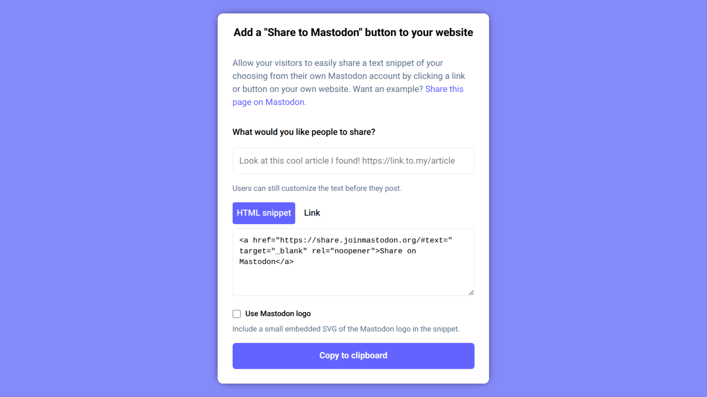

Have you ever wondered why news articles around the web have buttons to share to some of those other social sites, but not on Mastodon? There used to be a legitimate reason for this: unlike legacy social, Mastodon isn’t a single monolithic website you can link to; there are over 8,000 places where a person could have a Mastodon account! Their account could be on `mastodon.social`, the large, official server run by us. Or `hachyderm.io`, a sizeable server for tech enthusiasts operated by Nivenly. Or `social.coop`, a Mastodon server operated like a co-operative, where all members pay towards the costs and vote on decisions together. Some people run their own Mastodon servers, on their hardware at home. The distributed nature of the network is the greatest strength of Mastodon, but it also means that having a share button that takes you to the “correct” Mastodon server for your account, is a lot more involved than a simple hyperlink. Third party solutions have existed before now, but none of them have become ubiquitous, or easy to discover for website owners. This changes today, with our new official [Share tool](https://share.joinmastodon.org).

If you are a website owner, you can go to [share.joinmastodon.org](https://share.joinmastodon.org) to find instructions describing how to integrate this on your website. Of course, we’ve also [made the code available and open source](https://github.com/mastodon/share), the same as the rest of Mastodon’s code. That means you can check how it works, and even host a share page of your own (you don’t need to host anything, but you can, if you don’t want to use the version that we’re hosting - it’s your choice).

To try out what sharing something looks like right now, click “Share on Mastodon” on this very blog post (there's a button to do it, at the top right of the page). The tool itself works entirely in your browser: there is no tracking data, and it does not store any information on the server. If you have multiple Mastodon accounts, you can add more than one, and choose which one to share to when you post.

One more thing to mention here: back when we released Mastodon version 4.4, tucked away in [the release notes](https://github.com/mastodon/mastodon/releases/tag/v4.4.0#:~:text=referrer), we mentioned that server administrators have the option to send a referrer header when a link is clicked. If the owner of your server has enabled that setting, then websites whose links get shared will see traffic coming from Mastodon - yet another way to share how the community is growing.

We’re looking forward to seeing the Mastodon logo on more websites - possibly, alongside other social media platforms; and maybe even as the “main” sharing link, like here on our blog.
