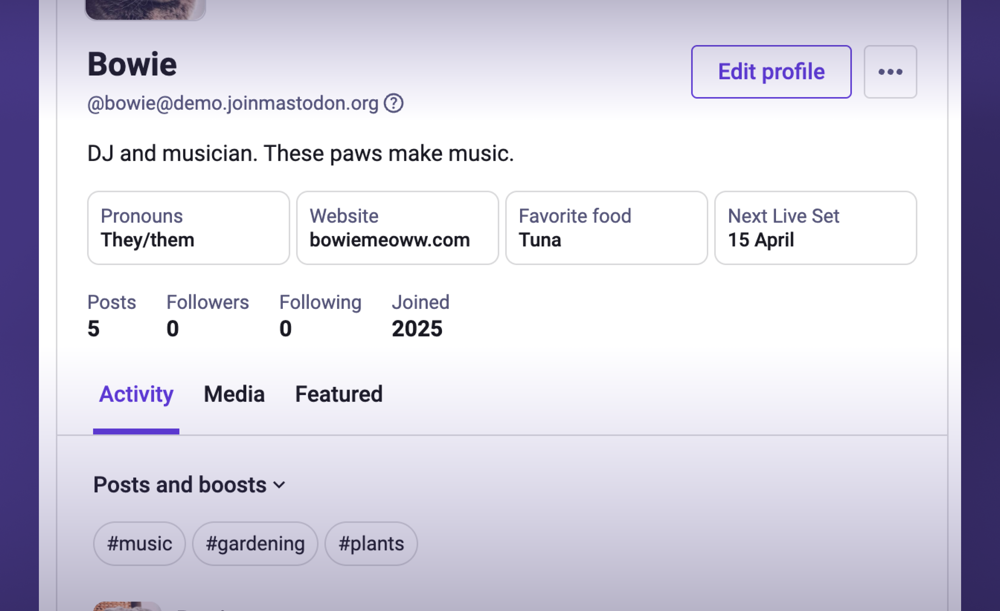
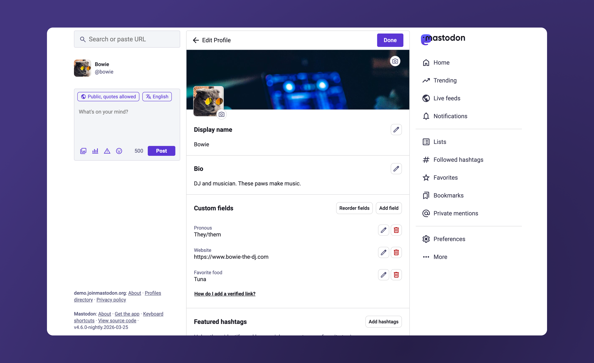
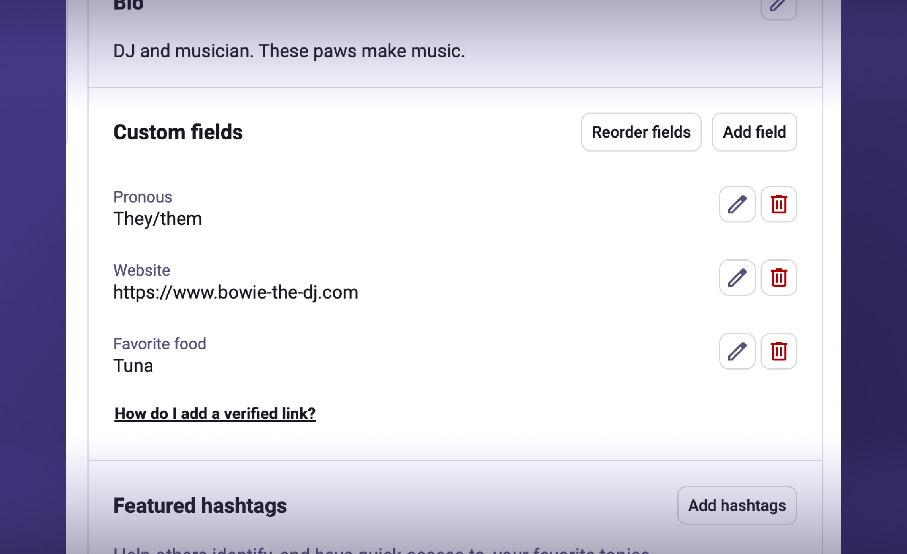
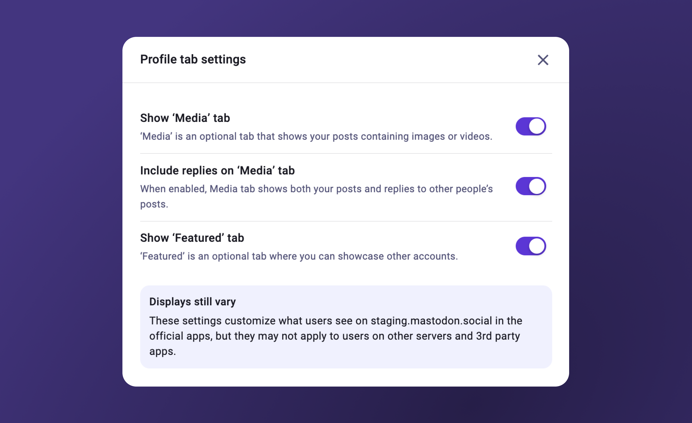

Profiles are the primary way for people using Mastodon to ‘meet’ one another on a deeper level – beyond a threaded conversation or search results. You might have noticed that the overall design of Profiles hasn’t been explored in a while, and in the meantime, we’ve heard requests and challenges from people who use Mastodon every day.

The profile redesign supports some of our current priorities:

- **Make the Fediverse Intuitive.** We want people who are new to Mastodon and the Fediverse to be able to discover and connect with interesting accounts, without having to understand the details of decentralisation. The new Profiles view includes an updated handle explainer, and a new editing experience delivers a more consistent, unified experience across web and native mobile apps.
- **A Home for Everyone.** As well as individuals, Mastodon is also home to organisations (NGOs, local governments, software projects, etc) that want to share news and interact with their communities. The layout changes offer us a solid starting point from which to explore features that will help these “institutional users” to make their most out of their presence in the Fediverse.

## Our approach

### Learning from the community

In addition to reviewing community requests related to profiles, we surveyed more than 500 people across over 300 servers, to understand what profile information they prioritise when it comes to identifying whether an account is trustworthy (and therefore, worth following). We also analysed patterns from other apps that respondents mentioned they frequently use.

### Technical constraints

We’re currently constrained within the existing 3-column layout on desktop.

We also know that improvements could be made to the custom fields feature, but structural and backend changes to custom fields were out of scope for this work.

## What’s changing

### Profile viewing

#### The new ‘Activity’ tab offers granular filtering of posts

Previously, there have been two tabs for “Posts” and “Posts and replies.” It turns out that this was misleading (the “Posts” tab also included boosts); and, that there was no way for you to view an account’s activity with the granularity that you can after following them – no view for Posts only, for example.

There are, in fact, 4 distinct views that you may want to see: *Posts*, *Posts+boosts*, *Posts+replies*, or *Posts+boosts+replies*. Providing this granularity led us to adopt a more appropriate UI over displaying each of these as tabs.

The new Activity tab has a dropdown menu, allowing you to view any of these combinations by filtering both boosts and replies. It is optimised to work equally well for you on the desktop as on mobile, and also if you use the advanced interface for desktop.

<video src="activity-dropdown.mp4" autoplay loop playsinline controls muted class="rounded-md shadow-lg"></video>

#### Featured hashtags are more discoverable and contextual

Hashtags can provide you with topic-based discovery. In the new Profile view, you can view hashtags contextually within the Activity tab, and click on them for a filtered view of the account’s tagged posts.

<video src="featured-filter-hashtags.mp4" autoplay loop playsinline controls muted class="rounded-md shadow-lg"></video>

#### It’s easier to view all pinned posts

Some people have expressed frustration over pinned posts being buried in a carousel. We understand this concern, and are also balancing the needs of people who are browsing others’ profiles who have shared that they want easy access to *recent* posts.

Informed by data on the number of pinned posts across Mastodon profiles, we’ve replaced the carousel with an alternative form of progressive disclosure that allows you to reveal all pinned posts in a single click.

<video src="revealing-pinned.mp4" autoplay loop playsinline controls muted class="rounded-md shadow-lg"></video>

#### Updated handle explainers

One of our objectives is to make the Fediverse more intuitive for people who are non-technical. We’ve updated the handle explainer card to clarify what handles and servers are.

Additionally, the full profile handle (`@user@domain.com`) now displays beneath the account’s display name, even if the account is on the same server as yours.

<figure>
  
  <figcaption>The updated explainer for profile handles.</figcaption>
</figure>

#### Custom fields are more compact

Custom fields display side-by-side when possible, making smarter utilisation of the Profile’s vertical space so that you get to the account’s content more swiftly.

<figure>
  
  <figcaption>A more compact design for custom fields.</figcaption>
</figure>

#### Additional changes reduce visual load

People must be able to find the content they need. However, when *all* information displays at once, it impacts your ability to focus and complete tasks.

You might notice we’ve given less prominence to a few pieces of information. When introducing changes that add friction, we take into account both the frequency and importance of related actions.

**Personal notes:** The ‘Add a personal note’ action does not display as prominently on the profile; it is now accessed within the profile’s overflow menu. If a note exists, it still displays on the profile page, just as it has in the past.

**‘Following you’:** The ‘Following you’ badge no longer displays on the profile. People we surveyed ranked this information remarkably low in terms of establishing both trust and interest an account. You still have numerous options to understand whether someone is following you:

- **The ‘Follow’ button:** When you’re not following an account but the account follows you, the primary button label displays as “Follow back”.
- **The accounts ‘Following’ list:** If the account is following you, you will see yourself at the top of that account’s ‘Following’ list.
- **Profile overflow menu:** If the account is following you, a ‘Remove follower’ option appears in the overflow menu.
- **Preview cards (desktop):** When hovering over an account, the preview cards still show ‘Follows you’ and ‘You follow each other’ statuses.

## Profile editing

### A unified editing experience

Previously, profile editing on web was hidden within account settings. You had to take multiple steps to navigate back to your profile view.

The new profile editing experience combines featured hashtags, link verification, and all other profile customisation in a single view. It’s easily accessible from an ‘Edit profile’ button directly on your profile – making switching between viewing and editing more seamless.

<figure>
  
  <figcaption>A screenshot of the redesigned profile editing experience on desktop web. The page shows sections for profile and cover photo editing, display name and bio editing, custom fields, featured hashtags, and profile tab settings.</figcaption>
</figure>

### More control during image upload

You can now crop images, and add alt text to profile and cover photos.

<figure>
<video src="profile-photo.mp4" autoplay loop playsinline controls muted class="rounded-md shadow-lg"></video>
<figcaption>A screen recording showing a user zooming and cropping a profile photo within a modal, then clicking on the “Next” button. On the next step, the modal displays a preview of the cropped image and a text field where the user can enter alt text.</figcaption>
</figure>

### Custom fields and verified links

Previously, custom field editing was only available on web, and lacked accessible form labels. Additionally, link verification – a powerful feature for establishing credibility – was hidden in profile settings.

Now, you can access link verification instructions directly from the custom field editing experience. You can also now add and edit custom fields in our iOS and Android apps.

<figure>
  
  <figcaption>A zoomed-in view of the interface for editing custom fields, which contains buttons for adding, reordering, changing, and deleting custom fields. Beneath the custom fields, a hyperlinked text reads “How do I add a verified link?”</figcaption>
</figure>

### Featured hashtags

Featured hashtags are a useful way of helping others discover topics you frequently post about. We’ve decreased the friction and guesswork in adding featured hashtags on web: Suggested hashtags will appear on your profile view, and can be bulk added in a single click.

For more granular control, hashtags can also be managed within the profile editor.

Basic functionality for featured hashtags is now supported on iOS and Android.

<figure><video src="featured-hashtags.mp4" autoplay loop playsinline controls muted class="rounded-md shadow-lg"></video>
<figcaption>A screen recording showing the interaction of a user viewing a banner on their own profile that contains suggested hashtags with options to add or dismiss. The user clicks on “Add” and the suggested hashtags are immediately added to their profile.</figcaption>
</figure>

### Customising tab displays

The editing experience includes profile tab display settings, allowing you to hide the ‘Media’ and ‘Featured’ tabs if desired.

Replies can also be excluded from the ‘Media’ tab, allowing for a more accurate gallery where creative people may showcase their work. We hope that these additional controls empower both people who use Mastodon day-to-day, and people who represent institutions.

Before the 4.6 release, profile tab customisations will only impact a few servers that are testing the new profile experience. After the 4.6 release, these customisations will be reflected on most servers running the latest version of Mastodon. Displays may vary on third-party apps and independent servers.

<figure>
  
  <figcaption>A screenshot of the Profile tab settings modal, which contains three settings allowing users to show/hide the Media tab, show/hide replies on the Media tab, and show/hide the Featured tab. A banner at the bottom of the modal explains that displays may vary on other servers.</figcaption>
</figure>

## Availability

The new design will be visible on `mastodon.social`, and other servers that run nightly builds of Mastodon, from today. The goal is to do some testing ahead of the 4.6 release, and make any adjustments based on feedback (see below). The new look will roll out to all Mastodon servers, as part of Mastodon 4.6, coming in a few weeks.

### We’re open to feedback

We’ve shared our thinking, and the choices we made in this redesign, in this post. If you have things you’d like to let us know related to these updates, contact us at [**feedback@joinmastodon.org**](mailto:feedback@joinmastodon.org). We may not be able to respond to every individual message, but we’ll be reading every piece of feedback to inform our future plans.
