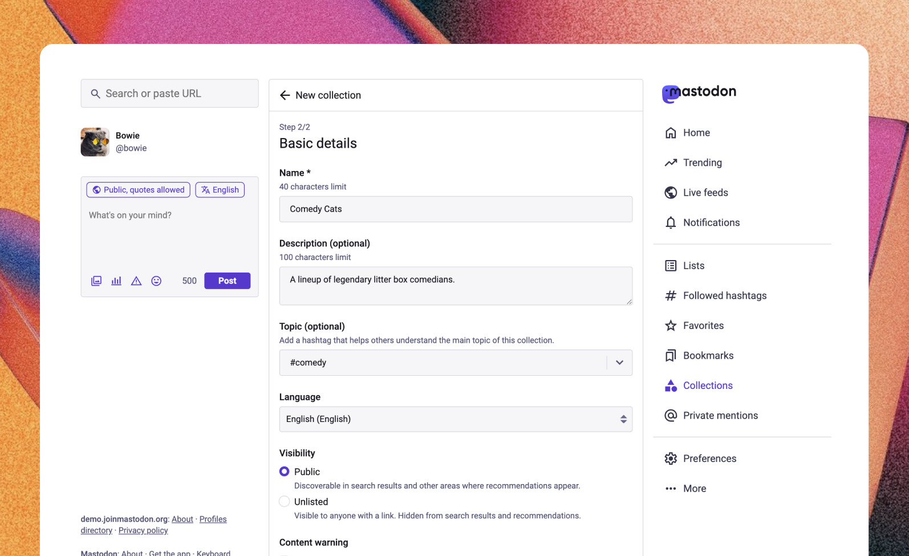

People come to the Fediverse to connect with others around communities and topics of interest. We’ve seen people enjoy their time on Mastodon the most, when they can follow and engage with individuals and organisations that have interesting things to share. We want to help those who are new to the Fediverse discover these communities more easily.

Back in October 2025, we [shared our initial ideas about a new feature](https://blog.joinmastodon.org/2025/10/our-ideas-about-packs/) that’s coming in Mastodon 4.6, that we’re calling *Collections*. Collections are a way for people on Mastodon to curate and share bundles of accounts that they’d recommend to others - helping to grow these connections more quickly, instead of newcomers hunting around for the accounts they might be interested in.

The team has been working hard on the feature since then, and in this post we’re providing an update on what you’ll see when Collections start to appear in the next few weeks. Importantly, this is just the beginning for Collections! Think of this as the “version 1” release for feedback - we’re taking a slow and intentional approach to building them out.

> We want to give a shout-out to some of the *other* great resources that help people to navigate and discover new content across the Fediverse - for example, [fedi.tips](http://fedi.tips) and their [@FediFollows account](https://social.growyourown.services/@FediFollows), the [starter packs from fedidevs.com](https://fedidevs.com/starter-packs/), and more. There’s room for all of these to offer alternative discovery options, and we appreciate the community initiatives; we hope Collections will be a useful addition.
{.info}

## Our approach

We had three primary inputs that shaped our thinking as we designed Collections.

### Learning from Bluesky

We reviewed public feedback around Bluesky’s Starter Packs to inform our approach before building this feature. The biggest influence this had on us, was that we knew that we needed to have a way to for people to review Collections they are added to, and to remove themselves without having to resort to blocking or reporting.

We made the decision early on that people are not automatically included in their own collections. Curators can add themselves, but it’s not a requirement. This also influenced our choice for smaller Collection sizes, at least at the start - we may revisit this later.

### Learning from the Mastodon community

We wanted to understand what information would be *most* helpful for people in deciding whether to follow accounts within a collection. Accounts currently display in list form, and we can’t show the entire profile - trade-offs must be made.

To understand what information to prioritise, we distributed a survey to people on Mastodon in late 2025. We found, unsurprisingly, that an account’s posts and bio text both have a huge influence on trust and interest. Additionally, being aware of mutuals (e.g. “people I follow who are following this account”) scored high on both points. Interestingly, recency of the account’s last post scored higher than the presence of a verified link, follower count, post count, and several other factors in influencing following behaviour (these findings also informed [the redesign of Profiles](https://blog.joinmastodon.org/2026/03/a-redesign-for-profiles/)). This study was conducted with limited resources - while not statistically significant, it offered us a starting point in understanding how Collections would be best represented.

### Technical constraints

Technical challenges limit our ability to show posts within a Collection for v1, but we’d like to explore this as the feature matures.

Collections are similar to our existing Lists feature, in that they’re account-based. Many people asked for public, shareable lists, but we don’t currently have the infrastructure to build something of that scale. However, we plan to reduce confusion through naming and navigational updates in a future release of Mastodon.

## Collections: What’s included in 4.6

We’re moving intentionally with this feature, using the 4.6 launch as an opportunity to learn more from the community. As such, we’ve taken a lightweight approach.

### Creation

People with accounts on participating servers will be able to create Collections. Collections may include a short description and topic – a single hashtag to aid in discovery. Additionally, Collections may be marked as sensitive (this setting hides the description and accounts behind a content warning).

<figure>
  
  <figcaption>A screenshot showing creation of a Collection.</figcaption>
</figure>

### Sharing and discovery

Collections can be set to either *Public* or *Unlisted*, and shared via a link.

There’s a caveat here - the initial launch focuses on *creation*, with search and discovery coming soon. There are three reasons we’re doing this:

1. The number of community-created Collections needs to hit a critical mass before certain discovery experiences become impactful. For example, we’d like server owners to be able to recommend Collections to follow during onboarding (this would be a replacement for the current Recommended Accounts feature).
2. We’d like to observe how the community creates and shares Collections first; this will help us to understand how and where to showcase public Collections.
3. Implementing Collections in search and discovery is technically expensive.

This means that *Public* and *Unlisted* Collections will function very similarly at first, except that public Collections are also included in the curator’s Featured tab on their profile.

### Privacy and moderation

You can opt out of having your account be eligible for inclusion in Collections by disabling the existing *“Feature profile and posts in discovery algorithms”* account setting.

If you are opted into discovery, you will be notified when another account adds you to a Collection. From there, you can view the contents of the Collection, and remove your account if desired.

In cases of potential harassment, you are encouraged to report or block the other account. Reporting a Collection allows a decision to be made by server moderators; blocking removes you from any collections curated by the blocked account, *and* prevents the blocked account from adding your account to future Collections.

## What’s *not* in the initial release

### Super large Collections

In this release, Collections can include up to 25 accounts.

Collections on Mastodon will continue to focus on quality over quantity. We suspect that smaller Collections will cut down on the type of spammy behaviour that was sometimes seen on Bluesky (where there is a limit of 150 accounts on Starter Packs). However, we don’t know *exactly* what the magic number is; we’ve talked to several industry leaders, and suspect the number is between 25 and 80. This is still a wide range, and we’re starting on the lower end because it’s far easier from a technical perspective to *increase* this limit later, than it is to reduce it.

Find yourself maxing out a Collection and then creating a “Volume 2”? Send us your Collection, if you want; or, tell us about it, so we can understand your use case.

### A ‘Follow All’ button

We’re not including a bulk follow action on day one.

This is something we’re considering, but we want to approach it with care. We read feedback that people on Bluesky often found themselves mass following accounts from stale Starter Packs, only to have a subpar feed afterwards.

We also recognise that there are scenarios that require more thought. For example, imagine you follow all accounts in a Collection, but then, some of the accounts are *removed* from the Collection. Do you expect to be able to bulk unfollow all of the accounts you previously followed from that Collection, even if they no longer exist there? Many people look to Mastodon to be the straightforward and authentic platform, so including a bulk follow action without an “escape hatch” is a dark pattern that we wish to avoid.

In short, we’re open to this in the future, but we’d like to understand the demand first. We hope to hear from the community about the experience of using “Collections v1”, and we may add a ‘Follow All’ button, potentially with proper undo controls, *if* there’s strong demand for reducing friction in the experience.

## Availability

We’ll be enabling Collections on `mastodon.social` in the coming week. As usual, we take a moment to test out these features on our own servers ahead of a release. This initial release of Collections will become generally available for all Mastodon servers as part of Mastodon 4.6, coming in a few weeks.

_note: we plan to add more screenshots to this post soon_

## Open to feedback

We’re focused on user privacy, and this means that we have very limited analytics to inform decisions. We also believe in community-driven design, and we want to be transparent about our thinking as we build new features. Our small team is counting on the insights from your experiences as you create, use, and test Collections! If you have things you’d like to let us know related to these updates, contact us at [**feedback@joinmastodon.org**](mailto:feedback@joinmastodon.org). We might not be able to respond individually, but rest assured that we’ll be reading every piece of feedback.

### Thanks

We are grateful to [GCC](https://www.gccofficial.org/en) for a grant that supported the development of this feature.
