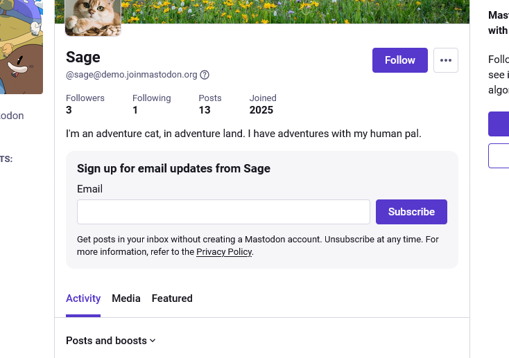
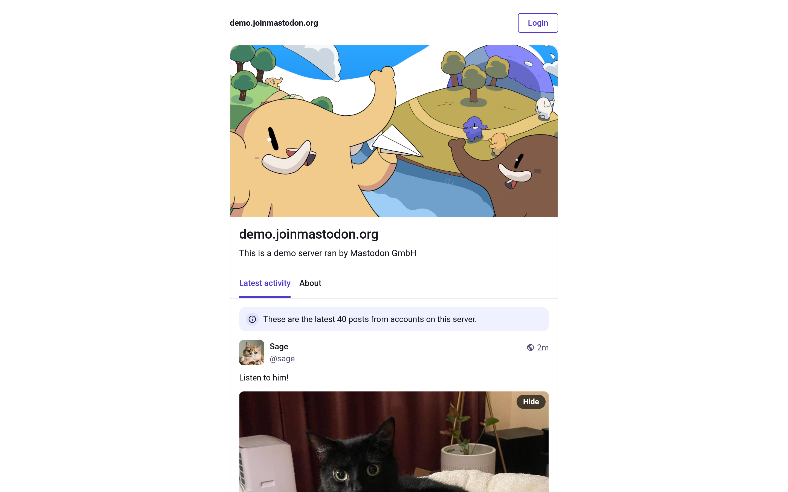

After many months of design, development, gathering feedback, and testing, today we're releasing a big update with **Mastodon 4.6**. The headliner of this release is Collections, a way to create and share curated collections of profiles. Part of Mastodon's work ethos is our commitment to trust and safety, so we've put a lot of thought and care into the design of this feature to avoid some of the pitfalls and abuse people have experienced with similar features on other platforms, while focusing on its primary goal: Helping new users discover more of the Fediverse.

### Collections

The quality that sets our Collections feature apart is that you can control which collections your profile appears in. If you aren't opted in to our "Feature me in discovery experiences" preference, you cannot be included in collections at all. If you are opted in, you will be notified every time you're added to a collection, and can always—at any time—remove yourself from a given collection. We've also limited the number of profiles that can be included in a single collection to 25, and decided not to offer a "follow all" shortcut. We might tune the exact number in the future, but the idea is that high volume makes collections harder to overview and therefore easier to use for spam (by e.g. sneaking in some profiles used for spam among a sea of legitimate ones).

<video src="creating-a-collection.mp4" autoplay playsinline muted loop class="rounded-md shadow-lg border border-blurple-500"></video>

Once you have created a collection, you can send the link to your friend or share it anywhere on the web, including Mastodon itself. Your collections will also be available on your own Mastodon profile, under the "Featured" tab. If you update the title or description of your collection later, the profiles that are on it will be notified, so no funny business! For now, finding collections is very manual, primarily through word of mouth. In the future, we are planning to introduce some ways to browse and discover popular collections.

### Profiles

After doing a survey to understand what information about other users our community values the most, we’ve updated the look of profiles on Mastodon to make them more ergonomic (and a little prettier!). Whether you like browsing a profile’s original posts only, or want to see everything they boost and reply to, it now takes fewer clicks to get to that information, and your preference applies on every profile you view. Featured hashtags are now also way more prominent and easier to access.

Perhaps even more importantly, we’ve reworked the entire editing experience for your profile. Instead of navigating away into the settings area just to update your profile picture, everything is available right from your profile by switching it into editing mode. Now you can crop your profile picture and header right there, instead of having to do it by hand before uploading. We’re also making it possible to add alt text for profile pictures and headers now, making your profile more accessible for blind and visually impaired users.

<video src="editing-profile.mp4" autoplay playsinline muted loop class="rounded-md shadow-lg border border-blurple-500"></video>

With the new profile editing experience comes a few brand new options for customising your profile. You can now control whether a “Media” tab shows at all, and if so, whether it should include media attachments from your replies to other people or not. This way, if you want to use it as a portfolio while hiding the GIFs and memes you use to respond to others, you can. You can also control if the “Featured” tab, which displays your collections and featured profiles, should show up or not.

### Newsletters

This feature is primarily for our institutional users, though we expect that journalists, bloggers, and other creators who run their own server might find it useful too: You can now opt-in to allow anonymous visitors to subscribe to your posts via e-mail, so even people who don’t have a Mastodon or Fediverse account and don’t wish to get one can keep up to date with you—given that you have an assigned role with the respective permission and the feature has been enabled on the server. We chose not to make this available for everyone by default as sending e-mail newsletters can significantly rack up the costs of operating a Mastodon server. You can discuss with your server administrator if you want to use this feature.

### New landing page variant

If you are looking at the Mastodon server of the European Commission or the German government, the “Trending” tab may not be the most suitable place to start. For this reason, we’re introducing a setting for a new type of landing page that highlights the description of the server and the most recent updates from local profiles, as well as a simplified interface that keeps you from wandering off.

### #Wrapstodon

You might remember for the past two years we’ve been offering your year in review on mastodon.social around the month of December. This is a feature we’ve been polishing and optimizing and it’s finally officially becoming available to all server administrators. Starting from December 10 each year, Mastodon will offer you an option to generate your year in review report—only if you agree will anything be generated. The offer can just as easily be dismissed. Unlike the original 2024 version of this feature, which required you to manually take a screenshot to share your #Wrapstodon with other people, it can now be shared as a link with anyone on the web. So that’s something to look forward to towards the end of the year!

### Accessibility fixes

We’ve already mentioned that you can now add alt text for profile pictures and headers, but that is just one of many countless accessibility improvements in Mastodon 4.6, from keyboard navigation and focus management, improving color contrasts, to various improvements to how screen readers navigate and read out things in the Mastodon interface. We want to thank the Dutch government who sponsored a significant part of this effort.

### In conclusion

Mastodon is the result of the work of our (now much larger!) engineering team and community contributors who submit patches, file bug reports, and translate Mastodon into their native languages. From our heart: **Thank you to everyone who contributed to this release, either through code, feedback, or by funding our mission.**

Delivering handcrafted code that runs on tens of thousands of servers and serves hundreds of thousands of users is not an easy task. We don’t take venture capital, we don’t sell ads, and we don’t sell your data—unlike many other platforms out there. **Please support our mission, so that we can continue to make Mastodon better, and work towards an internet that is diverse, fun, and free from corporate control.**


