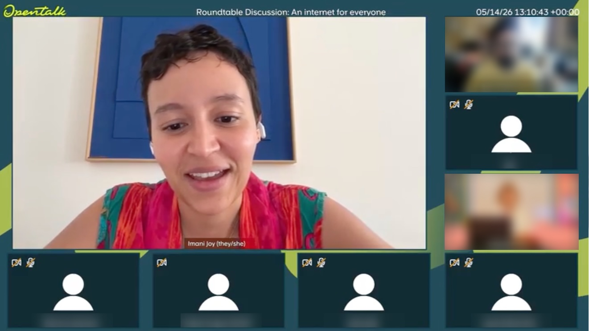

I joined Mastodon in the summer of 2025 as the first full-time design hire. I have an extensive background in improving software usability, diversity and belonging for online communities, but I was new to Mastodon and the fediverse.

Immediately, I was impressed with the richness of this decentralised space, the passion of the open-source community, and the near-endless capabilities of the software itself. Moreover, I was inspired by the engineering team’s ability to build and maintain such complex and important software – and to do so in a way that supports other softwares (through FEPs and FASPs). The shared commitment to a thriving fediverse was clear.

What I also saw, though, is that our team was overwhelmed with the volume of user feedback we receive – through Discord conversations, Github issues, third-party audits and studies, thinkpieces in personal blogs, and of course, Mastodon posts. As I write this, our Github repository has 4.3K open issues and 1,000 open discussions, many of which include ideas and complaints related to the user experience. This is more than any team of our size could reasonably manage. And this overwhelm often manifests in a lack of clarity on how to move forward.

***What should we prioritise?*** As we moved from [project](/2025/09/introducing-quote-posts/) to [project](/2026/04/designing-collections/), these four words kept emerging in the least-expected moments. We were beginning to find our way in terms of creating a [development roadmap](https://joinmastodon.org/roadmap), but beyond major projects and obvious requirements (based in security, compliance, and grant-based deliverables) it was often unclear which feedback to take action on first.

This challenge isn’t unique to Mastodon, by the way – but it *is* made more complex due to the nature of the software and its surrounding culture. Currently, our most vocal community members tend to be the most technically-minded ones, and are often Github contributors themselves. However, if we only listen to Github feedback, how will we learn the needs of non-technical users? If we respond immediately to every feature request, what might we be missing about the underlying needs, values, and goals of our community? In short, *what actually matters, to whom, and why*?

This is how the idea for Discovery Week emerged. As we gazed ahead at Mastodon’s 10th anniversary and prepared for our next major release, I saw an opportunity to cut through the clutter and invite the community to talk with us.

Discovery Week was informal and tightly scoped. It was pulled together in weeks, without funding earmarked for research. It was also massively insightful. The stories and feedback shared by our community helped us understand many perspectives more deeply. I particularly enjoyed witnessing community members with different perspectives engaging collaboratively in the live roundtables – to me, these moments highlighted Mastodon’s potential to bring out the best of online discourse.

My deep gratitude goes out to everyone who completed a survey, volunteered for a roundtable, or shared the Discovery Week post so others could participate. Additional thanks to those of you who shared existing publications and Github issues that were particularly relevant to the themes explored. And it’s worth acknowledging that Discovery Week wasn’t the beginning. Thanks to the community who has contributed feedback and ideas over several years, many of which are simply confirmed in this document to help our team make sense of what matters.

<video src="discovery_week_sticky_notes.mp4" autoplay playsinline muted loop class="rounded-md shadow-lg border border-blurple-500"></video>

Discovery Week has already proven to be tremendously helpful in guiding our direction for Mastodon v5.0 and beyond. Some changes will take weeks, and others, years. Overall, we hope that the upcoming improvements to the Mastodon experience reflect what the community wants to see. Here’s to this being the first of many Discovery Weeks for Mastodon\!

Onward and upward,

Imani Joy\
Head of Design, Mastodon

**Download the full report**

- [Discovery Week 2026 Report Only](./Discovery%20Week%202026%20Report.pdf) – PDF *(378 kB)*
- [Discovery Week 2026 Appendix](./Discovery%20Week%202026%20Appendix.pdf) – PDF *(13.9 MB)*
- [Discovery Week 2026 Report + Appendix](./Discovery%20Week%202026%20Report%20+%20Appendix.zip) – HTML, Zipped *(4.8 MB)*
